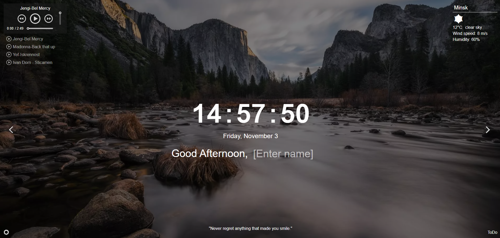

# [**Momentum**](https://momentum-project-case.netlify.app/)
Momentum is an analog of the eponymous Chrome extension for an internet store. The application displays the time and the user's name. The background image and greeting change depending on the time of day.
The application includes clocks, an image slider, weather widgets, an audio player, a quote of the day block, and settings. Local storage is used to store the user's name and location.

## Key Skills:

- Methods for finding elements
- Data output to the page
- Working with date and time
- Working with audio
- Saving data to local storage
- Using recursive setTimeout
- Dividing JavaScript code into modules
- Working with asynchronous requests

## Application Functionality

- Clocks and calendar
- Changing the background image
- Weather widget- Quote of the day widget
- Audio player
- Application translation into two languages (en/ru or en/be)
- Application settings
- ToDo List- List of quotes

 ## Technologies
- JavaScript
- HTML,SCSS
- Webpack

## Utilization

### [**Momentum**](https://momentum-project-case.netlify.app/)

## Sources

